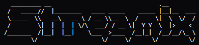
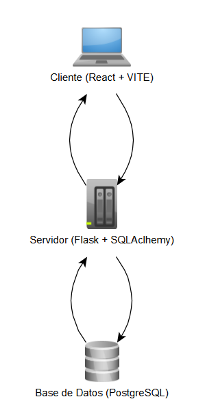
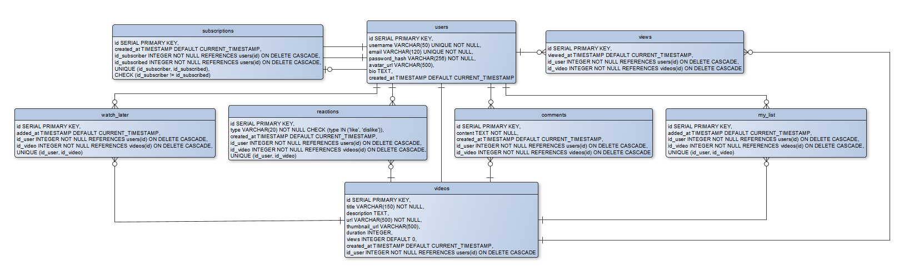

<p align="center">
  
</p>

<p align="center">
    <a href="#"></a>
    <a href="#"></a>
    <a href="#"></a>
    <a href="#"></a>
</p>

## Descripción General

Streamix es una aplicación web full-stack diseñada para compartir y transmitir videos. Permite a los usuarios subir videos, interactuar con el contenido a través de likes y comentarios, suscribirse a otros creadores y gestionar listas personalizadas (Ver más tarde, Mi lista).

La aplicación está construida con una arquitectura moderna, utilizando un robusto backend en Flask/Python y un frontend responsivo en React, completamente orquestado con Docker.

---

## Arquitectura

<p align="center">
  
</p>

El proyecto sigue una arquitectura **Cliente-Servidor (SPA + API REST)** y está dividido en tres servicios principales orquestados mediante Docker Compose:

1. **Frontend (`client`):** Aplicación de una sola página (SPA) construida con React y Vite.
2. **Backend (`server`):** API RESTful desarrollada en Python con Flask y SQLAlchemy.
3. **Base de Datos (`db`):** Motor relacional PostgreSQL.

---

## Modelo Relacional de Base de Datos

<p align="center">
  
</p>

El sistema utiliza una base de datos relacional para garantizar la integridad referencial entre usuarios, videos y las interacciones sociales (comentarios, reacciones, suscripciones).

---

## Tecnologías Principales

- **Frontend:** React, Vite, React Router, CSS Vanilla.
- **Backend:** Python 3.11, Flask, SQLAlchemy (ORM), PyJWT, psycopg2.
- **Base de Datos:** PostgreSQL 15.
- **Testing:** Playwright (Pruebas E2E de API).
- **Infraestructura:** Docker, Docker Compose.

---

## Requisitos Previos

Antes de ejecutar el proyecto, asegúrate de tener instalado en tu sistema:

- [Docker](https://docs.docker.com/get-docker/)
- [Docker Compose](https://docs.docker.com/compose/install/)
- [Node.js 20+](https://nodejs.org/) (Opcional, si deseas correr pruebas localmente fuera de los contenedores).

---

## Configuración y Ejecución

### 1. Variables de Entorno

En la raíz del proyecto, asegúrate de tener tu archivo `.env` configurado. Puedes crear uno copiando el archivo de ejemplo (si existe) o usando esta base:

```env
# Credenciales de Base de Datos
DB_USER=streamix_user
DB_PASSWORD=streamix_password
DB_NAME=streamix
DB_HOST=db
DB_PORT=5432

# Clave Secreta del Backend (para JWT)
SECRET_KEY=tu_super_secreto_aqui_123

# Variables de Entorno del Frontend
VITE_API_URL=http://localhost:5050/api
```

### 2. Levantar los Servicios

La aplicación está completamente dockerizada. Para iniciar todos los servicios (Base de datos, Backend y Frontend), ejecuta en la raíz del proyecto:

```bash
docker compose up --build -d
```

Este comando descargará las imágenes, construirá los contenedores y los ejecutará en segundo plano.

**Servicios y Rutas Disponibles:**
- **Frontend:** `http://localhost:5173`
- **Backend API:** `http://localhost:5050`
- **Ruta de Salud (Health Check):** `http://localhost:5050/api/` (Retorna estado de la API).
- **Documentación Swagger (Docs):** `http://localhost:5050/api/docs` (Interfaz de Swagger UI con todos los endpoints detallados).
- **Base de Datos:** `localhost:5433` (Expuesta en este puerto local para conexiones externas mediante clientes como DBeaver o pgAdmin).

### 3. Detener la Aplicación

Para apagar los contenedores sin borrar los datos:
```bash
docker compose down
```

Si necesitas reiniciar desde cero y **borrar la base de datos**, añade el flag de volumen:
```bash
docker compose down -v
```

---

## Pruebas Automatizadas (Playwright)

El proyecto cuenta con una robusta suite de pruebas End-to-End (E2E) enfocadas en validar la integridad y seguridad de la API. En total, hay **80 pruebas automatizadas**.

### Preparación para Pruebas
Si acabas de realizar cambios estructurales, es recomendable limpiar la base de datos e iniciar en limpio:
```bash
docker compose down -v
docker compose up --build -d
```

### Ejecutar las Pruebas
Asegúrate de haber instalado los paquetes de dependencias locales en la carpeta raíz (si no lo has hecho, corre `npm install`). 

Luego ejecuta las pruebas usando el worker de Chromium para evitar sobrecarga en la base de datos local:

```bash
npx playwright test
```
*(Nota: El archivo `playwright.config.ts` ya está configurado para ejecutar solo Chromium y de manera secuencial).*

---

## Estructura del Proyecto

```plaintext
streamix-app/
├── client/                 # Código fuente de React (Frontend)
│   ├── src/
│   ├── index.html
│   └── Dockerfile
├── server/                 # Código fuente de Flask (Backend)
│   ├── app/                # Rutas, Modelos e Inicialización
│   ├── run.py              # Entrypoint y scripts de inicio DB
│   └── Dockerfile
├── tests/                  # Suite de pruebas E2E
│   ├── api.spec.ts         # Las 80 pruebas de la API
│   └── fixtures/           # Archivos dummy para tests (auto-generables)
├── docker-compose.yml      # Orquestación de servicios
├── playwright.config.ts    # Configuración de pruebas
└── README.md               # Este archivo
```
